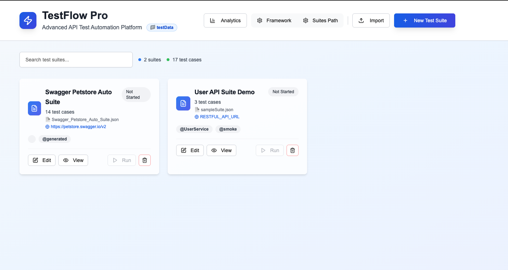
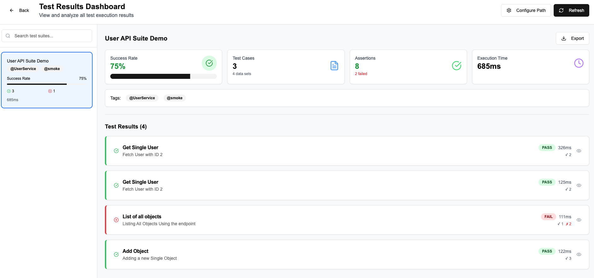

# 🔍 Keyword-Driven API Testing Framework

A powerful, flexible, and pluggable **API automation framework** built in **TypeScript**, using **Axios** and **JSON-driven test configuration**.  
Designed for **REST API testing**, it supports dynamic data, pre-processing, assertions, schema validation, and multi-suite execution.

TODO:
- SOAP API (Done)
- GraphQL
- Kafka Integration
- Database integration

---
## Youtube Video
- https://www.youtube.com/watch?v=Jw-B24hmNhQ
## 🚀 Features

- ✅ **Keyword-driven architecture**
- ✅ Test cases driven entirely by **JSON files**
- ✅ **Data-driven** test cases within each suite
- ✅ Powerful **variable injection and response chaining**
- ✅ **Pre-processing hooks** (e.g., faker, encryption, custom token)
- ✅ External **bodyFile** and **responseSchemaFile** support
- ✅ **JSONPath-based assertions**
- ✅ **JSON Schema validation** (inline and file-based)
- ✅ Suite-level **tags** (e.g., `@serviceName`, `@suiteType`)
- ✅ **Parallel execution** for suites
- ✅ **.env support** for environment management
- ✅ **Command-line filters** (by tag)
- ✅ **JSON reports** with summary and optional response bodies
- ✅ **Test Suite Run** We can run Suites from UI
- ✅ **Test Suite Results** We can see Test Run results summary in Ananlysis Section

---

### Test Designer



---

## 🧪 Sample Suite JSON

```json
{
  "suiteName": "Bookstore API Suite",
  "status": "Not Started",
  "baseUrl": "https://api.bookstore.com",
  "tags": [
    {
      "serviceName": "@BookService"
    },
    {
      "suiteType": "@regression"
    }
  ],
  "testCases": [
    {
      "name": "Get Book Details",
      "status": "Not Started",
      "testData": [
        {
          "name": "Fetch book with ID 101",
          "method": "GET",
          "endpoint": "/books/101",
          "headers": {
            "Content-Type": "application/json"
          },
          "assertions": [
            {
              "type": "equals",
              "jsonPath": "$.title",
              "expected": "The Pragmatic Programmer"
            },
            {
              "type": "equals",
              "jsonPath": "$.author",
              "expected": "Andrew Hunt"
            },
            {
              "type": "statusCode",
              "expected": 200
            }
          ],
          "responseSchema": {
            "$schema": "http://json-schema.org/draft-07/schema#",
            "type": "object",
            "required": ["id", "title", "author", "price"],
            "properties": {
              "id": { "type": "number" },
              "title": { "type": "string" },
              "author": { "type": "string" },
              "price": { "type": "number" }
            }
          },
          "store": {
            "bookTitle": "$.title",
            "bookPrice": "$.price"
          }
        }
      ]
    },
    {
      "name": "Create New Book",
      "status": "Not Started",
      "testData": [
        {
          "name": "Add new book to catalog",
          "method": "POST",
          "endpoint": "/books",
          "headers": {
            "Content-Type": "application/json"
          },
          "preProcess": [
            {
              "var": "randomISBN",
              "function": "faker.isbn"
            },
            {
              "var": "authToken",
              "function": "authToken"
            }
          ],
          "body": {
            "title": "Clean Code",
            "author": "Robert C. Martin",
            "isbn": "{{randomISBN}}",
            "price": 499.99
          },
          "assertions": [
            {
              "type": "statusCode",
              "expected": 201
            },
            {
              "type": "exists",
              "jsonPath": "$.id"
            }
          ],
          "store": {
            "newBookId": "$.id"
          }
        }
      ]
    },
    {
      "name": "List All Books",
      "status": "Not Started",
      "testData": [
        {
          "name": "Get all books",
          "method": "GET",
          "endpoint": "/books",
          "headers": {
            "Content-Type": "application/json"
          },
          "assertions": [
            {
              "type": "size",
              "jsonPath": "$",
              "expected": 10
            },
            {
              "type": "contains",
              "jsonPath": "$[*].title",
              "expected": "Clean Code"
            },
            {
              "type": "statusCode",
              "expected": 200
            }
          ]
        }
      ]
    }
  ]
}
````

### 🔍 What This Sample Demonstrates:

| Feature                    | Usage Example                                        |
| -------------------------- | ---------------------------------------------------- |
| **Base URL & Tags**        | `baseUrl`, `@BookService`, `@regression` tags        |
| **Pre-processing**         | Dynamic values like `faker.isbn`, `authToken`        |
| **Assertions**             | `equals`, `contains`, `statusCode`, `size`, `exists` |
| **JSON Schema Validation** | Validates book object format                         |
| **Variable Storage**       | Saves values like book ID, title for future use      |

# 🧰 PreProcess Functions

````
"preProcess": [
{ "var": "randomEmail", "function": "faker.email" },
{ "var": "encryptedPassword", "function": "encrypt", "args": ["P@ssword"] },
{ "var": "authToken", "function": "custom.authToken" }
]
````

## ✅ Supported Pre-Processing Functions:

| Function           | Output Description               |
| ------------------ | -------------------------------- |
| `faker.email`      | Generates a random email         |
| `faker.uuid`       | Generates UUID                   |
| `faker.username`   | Generates a fake username        |
| `date.now`         | Current timestamp                |
| `encrypt`          | AES-256 encryption of string     |
| `custom.authToken` | Generates token via custom logic |

## 🛡 Assertions

| `type`             | Description                                                                |
| ------------------ | -------------------------------------------------------------------------- |
| `equals`           | Value is equal to expected                                                 |
| `notEquals`        | Value is not equal to expected                                             |
| `contains`         | Result contains substring or value                                         |
| `startsWith`       | Result string starts with expected value                                   |
| `endsWith`         | Result string ends with expected value                                     |
| `greaterThan`      | Result is greater than expected (numeric)                                  |
| `lessThan`         | Result is less than expected (numeric)                                     |
| `in`               | Result exists in an array of expected values                               |
| `notIn`            | Result does not exist in an array of expected values                       |
| `includesAll`      | Array result must include all specified values                             |
| `length`           | Checks length of array or string                                           |
| `size`             | Checks number of keys (if object) or elements (if array)                   |
| `type`             | Type of result matches (e.g., `"string"`, `"number"`)                      |
| `exists`           | Path exists                                                                |
| `regex`            | Regex pattern matches result                                               |
| `statusCode`       | Validates HTTP status code                                                 |
| `arrayObjectMatch` | Search array of objects for a field/value match and assert a sibling field |


````
"assertions": [
  { "type": "statusCode", "jsonPath": "$.", "expected": 200 },
  { "type": "equals", "jsonPath": "$.data.id", "expected": "abc123" },
  { "type": "notEquals", "jsonPath": "$.data.status", "expected": "error" },
  { "type": "contains", "jsonPath": "$.message", "expected": "success" },
  { "type": "startsWith", "jsonPath": "$.user.email", "expected": "test" },
  { "type": "greaterThan", "jsonPath": "$.data.age", "expected": 18 },
  { "type": "lessThan", "jsonPath": "$.data.age", "expected": 60 },
  { "type": "in", "jsonPath": "$.status", "expected": ["active", "pending"] },
  { "type": "includesAll", "jsonPath": "$.roles", "expected": ["admin", "editor"] },
  { "type": "length", "jsonPath": "$.items", "expected": 5 },
  { "type": "regex", "jsonPath": "$.email", "expected": "^[\\w-.]+@([\\w-]+\\.)+[\\w-]{2,4}$" },
  {
    "type": "arrayObjectMatch",
    "jsonPath": "$.data",
    "matchField": "name",
    "matchValue": "Company",
    "assertField": "value",
    "expected": "MBS"
  }
]

-------------------------
arrayObjectMatch is ideal when:
The array contains { name: "X", value: "Y" } objects
Element order is dynamic
````

- statusCode: Validate HTTP status 
- jsonPath + expectedValue: Validate value
- jsonPath + expectedType: Validate data type
- Additional ideas: expectedLength, contains, etc.

## 📁 External Files Support

✅ bodyFile <br>
"bodyFile": "./payloads/login-body.json"

✅ responseSchemaFile <br>
"responseSchemaFile": "./schemas/user-response-schema.json"

## 🔗 Variable Injection & Storage

- Inject values like ${authToken}, ${randomEmail} into endpoint, headers, body
- Chain values across test cases using "store" field:
```
"store": {
"userId": "$.id"
}
```
- Array Object Match (for unordered arrays)
```html
  "store": [
  {
  "type": "arrayObjectMatch",
  "jsonPath": "$.data",
  "matchField": "name",
  "matchValue": "Company",
  "extractField": "value",
  "variableName": "companyName"
  }
  ]
  ```
Use stored variables in later requests as {{variableName}}.


## ⚙️ Environment Configuration (.env)

```
BASE_URL=https://api.example.com
PARALLEL_THREADS=4
```

📊 JSON Report Format (report.json)


🚀 Running Tests

```shell
#Install dependencies
npm install
# Run tests in parallel mode
npx ts-node src/runner.ts 

# Run tests with CLI tag filters
npx ts-node src/runner.ts --serviceName=@UserService --suiteType=@smoke

# Run Frontend APP
npm install --legacy-peer-deps
npm run dev
```


