# 🔍 TestFlow Pro – Keyword-Driven API Automation Framework

A powerful and flexible API test automation tool built with **TypeScript**, supporting **REST**, **SOAP**, **UI**, and **Database** testing using **JSON-driven test cases**. It is designed for scalable and maintainable testing with no-code authoring and comprehensive UI support.

---

## 🏗️ Architecture Overview

```mermaid
graph TB
    subgraph "TestFlow Pro Architecture"
        UI[🎨 Web UI Dashboard<br/>React + Next.js]
        CLI[⚡ CLI Runner<br/>TypeScript]
        
        subgraph "Test Execution Engine"
            Runner[🚀 Test Runner]
            APIExec[🌐 API Executor<br/>REST/SOAP]
            UIExec[🖱️ UI Executor<br/>Playwright]
            DBExec[🗄️ DB Executor<br/>MySQL/ODBC/DB2]
        end
        
        subgraph "Test Management"
            Parser[📝 Test Parser]
            Validator[✅ Schema Validator]
            VarStore[💾 Variable Store]
            PreProc[⚙️ PreProcessor<br/>Faker/Encrypt/Custom]
        end
        
        subgraph "Import & Export"
            CurlImp[📥 cURL Import]
            SwagImp[📥 Swagger Import]
            PostImp[📥 Postman Import]
            BrunoImp[📥 Bruno Import]
            HTMLExp[📤 HTML Reports]
            JSONExp[📤 JSON Reports]
        end
        
        subgraph "Storage & Config"
            TestSuites[(📁 Test Suites<br/>JSON Files)]
            EnvFiles[(🔧 Environment<br/>.env files)]
            Reports[(📊 Reports<br/>HTML/JSON)]
        end
        
        subgraph "CI/CD Integration"
            GHA[🔄 GitHub Actions<br/>Workflows]
            Artifacts[📦 Test Artifacts]
        end
    end
    
    UI --> Runner
    CLI --> Runner
    Runner --> APIExec
    Runner --> UIExec
    Runner --> DBExec
    
    Runner --> Parser
    Parser --> Validator
    Parser --> VarStore
    Parser --> PreProc
    
    UI --> CurlImp
    UI --> SwagImp
    UI --> PostImp
    UI --> BrunoImp
    
    Runner --> HTMLExp
    Runner --> JSONExp
    
    Runner --> TestSuites
    Runner --> EnvFiles
    HTMLExp --> Reports
    JSONExp --> Reports
    
    GHA --> CLI
    GHA --> Artifacts
    
    TestSuites --> Parser
    EnvFiles --> Runner
```



---

## ▶️ Demo Video

* [YouTube Part-1](https://www.youtube.com/watch?v=Jw-B24hmNhQ)
* [YouTube Part-2](https://www.youtube.com/watch?v=wWXK-iqgtTE)

---

## 🚀 Features

### Core Testing Features
* ✅ **Keyword-driven JSON test case authoring**
* ✅ **Data-driven execution** (within each test case)
* ✅ **Preprocessing hooks** (`faker`, `encrypt`, `authToken`, `dbQuery`, custom logic)
* ✅ **Variable injection & response chaining**
* ✅ **Schema validation** (inline or file-based)
* ✅ **JSONPath-based assertions**
* ✅ **REST & SOAP** API support
* ✅ **UI Testing** with Playwright integration
* ✅ **External body/response schema file support**
* ✅ **Suite tags** (`@serviceName`, `@suiteType`) with CLI filters
* ✅ **Environment config via `.env.*` files**
* ✅ **Parallel test suite execution**
* ✅ **Database integration** with MySQL, ODBC, DB2

### Advanced Execution Features
* ✅ **Granular Execution Control** - Run at suite, test case, or test data level
* ✅ **Application-based Filtering** - Filter tests by application name
* ✅ **Test Type Filtering** - Run only UI or API tests
* ✅ **Enhanced CLI Arguments** - Multiple filtering options
* ✅ **Target-based Execution** - Execute specific test components

### UI & Import Features
* ✅ **Modern Test Designer UI** with professional slate color scheme
* ✅ **Fixed Header Navigation** - Always accessible controls
* ✅ **Folder Tree Structure** - Hierarchical test suite organization
* ✅ **Application Grouping** - Organize tests by application
* ✅ **Search & Filtering** - Real-time test suite filtering
* ✅ **Multiple Import Options**: cURL, Swagger/OpenAPI, Postman, Bruno collections
* ✅ **Environment Variables Manager** - Edit .env files directly from UI
* ✅ **Test cURL Commands** - Execute and validate before importing
* ✅ **Real-time Import Preview** - See converted test suites before saving

### Reporting & Export
* ✅ **HTML/JSON reports with summaries**
* ✅ **Beautiful HTML Report Export** - Individual suites and complete runs
* ✅ **Response Body Capture** - Always stored for passed and failed tests
* ✅ **Test Result Details** - Complete execution information

### CI/CD Integration
* ✅ **GitHub Actions Workflows** - Ready-to-use automation
* ✅ **Tag-based Execution** - Run tests by service/suite tags
* ✅ **Application-based Execution** - Run tests by application name
* ✅ **Matrix Testing** - Multi-environment test execution
* ✅ **Artifact Management** - Automatic report uploads

---

## 🧪 Sample Suite JSON

```json
{
  "id": "bookstore-api-001",
  "suiteName": "Bookstore API Suite",
  "applicationName": "Bookstore Application",
  "type": "API",
  "baseUrl": "https://api.bookstore.com",
  "tags": [
    { "serviceName": "@BookService" },
    { "suiteType": "@regression" }
  ],
  "testCases": [
    {
      "name": "Create Book",
      "type": "REST",
      "testData": [
        {
          "name": "Add Book",
          "method": "POST",
          "endpoint": "/books",
          "headers": { "Content-Type": "application/json" },
          "preProcess": [
            { "var": "randomISBN", "function": "faker.uuid" },
            { "var": "authToken", "function": "custom.authToken" }
          ],
          "body": {
            "title": "Clean Code",
            "author": "Robert C. Martin",
            "isbn": "{{randomISBN}}"
          },
          "assertions": [
            { "type": "statusCode", "expected": 201 },
            { "type": "exists", "jsonPath": "$.id" }
          ],
          "store": {
            "newBookId": "$.id"
          }
        }
      ]
    }
  ]
}
```

---

## 🎯 Enhanced CLI Usage

### Basic Execution
```bash
# Run all test suites
npx ts-node src/runner.ts

# Run specific test suite file
npx ts-node src/runner.ts --file="./testSuites/api-tests.json"
```

### Advanced Filtering
```bash
# Filter by application name
npx ts-node src/runner.ts --applicationName="Bookstore Application"

# Filter by test type
npx ts-node src/runner.ts --testType="API"
npx ts-node src/runner.ts --testType="UI"

# Filter by tags
npx ts-node src/runner.ts --serviceName="@BookService" --suiteType="@smoke"

# Combine multiple filters
npx ts-node src/runner.ts --applicationName="Bookstore" --testType="API" --suiteType="@regression"
```

### Granular Execution
```bash
# Run specific test case
npx ts-node src/runner.ts --target="suite-001:Bookstore Suite > tc-001:Create Book"

# Run specific test data
npx ts-node src/runner.ts --target="suite-001:Bookstore Suite > tc-001:Create Book > 0:Add Valid Book"
```

---

## 🔄 GitHub Actions Integration

### Available Workflows

#### 1. **Run Tests by Tags** (`run-tests-by-tags.yml`)
```yaml
# Manual trigger with tag filtering
inputs:
  serviceName: "@UserService"
  suiteType: "@smoke" 
  environment: "qa"
```

#### 2. **Run Tests by Application** (`run-tests-by-application.yml`)
```yaml
# Manual trigger with application filtering
inputs:
  applicationName: "Bookstore Application"
  testType: "API"
  environment: "qa"
```

#### 3. **Run Tests Matrix** (`run-tests-matrix.yml`)
```yaml
# Manual trigger with matrix execution
inputs:
  environments: "dev,qa,prod"
  testTypes: "API,UI"
  tags: "@smoke,@regression"
```

### Workflow Features
* ✅ **Environment Management** - Automatic `.env` file handling
* ✅ **HTML Report Generation** - `npm run report:html`
* ✅ **Artifact Uploads** - JSON and HTML reports
* ✅ **Manual Triggers Only** - No automatic scheduling

---

## 🔧 PreProcess Functions

```json
[
  { "var": "randomEmail", "function": "faker.email" },
  { "var": "encryptedPwd", "function": "encrypt", "args": ["P@ssw0rd"] },
  { "function": "dbQuery", "args": ["SELECT id, name FROM users LIMIT 1"], "db": "userDb", "mapTo": { "userId": "id", "userName": "name" } }
]
```

### ✅ Supported Functions

| Function           | Description                                                               |
| ------------------ | ------------------------------------------------------------------------- |
| `faker.email`      | Generates random email                                                    |
| `faker.uuid`       | Generates UUID                                                            |
| `faker.username`   | Generates username                                                        |
| `date.now`         | Current timestamp                                                         |
| `encrypt`          | AES-256 encrypts string                                                   |
| `custom.authToken` | Custom logic for token                                                    |
| `generateUser`     | Custom function returning multiple keys (use with `mapTo`)                |
| `dbQuery`          | SQL query to DB (MySQL/ODBC/DB2) with support for `mapTo` or single `var` |

---

## 🛡 Assertion Types

| Type               | Description                                             |
| ------------------ | ------------------------------------------------------- |
| `equals`           | Strict equality                                         |
| `notEquals`        | Inverse equality                                        |
| `contains`         | Value contains expected                                 |
| `startsWith`       | Starts with value                                       |
| `endsWith`         | Ends with value                                         |
| `greaterThan`      | > expected                                              |
| `lessThan`         | < expected                                              |
| `in`               | Is one of the expected array                            |
| `notIn`            | Not in array                                            |
| `includesAll`      | Array includes all values                               |
| `length`           | Length of string/array                                  |
| `size`             | Size of array/object                                    |
| `type`             | Validates value type (e.g., string, number)             |
| `exists`           | Ensures JSONPath exists                                 |
| `regex`            | Regex pattern matches                                   |
| `statusCode`       | HTTP status code check                                  |
| `arrayObjectMatch` | Searches array of objects for match + sibling assertion |

---

## 🎨 Modern UI Features

### Dashboard Interface
* ✅ **Fixed Header Navigation** - Always accessible controls
* ✅ **Modern Folder Tree** - Hierarchical structure with visual connections
* ✅ **Application Sidebar** - Organized by application (320px width)
* ✅ **Search Integration** - Real-time filtering across folder structure
* ✅ **Responsive Design** - Full viewport height utilization

### Visual Enhancements
* ✅ **Professional Slate Theme** - Eye-strain reducing design
* ✅ **Smooth Animations** - Hover effects and transitions
* ✅ **Color-coded Icons** - Blue folders, purple UI tests, emerald API tests
* ✅ **Badge Integration** - Suite counts and type indicators close to names
* ✅ **Horizontal Scrolling** - Handle long names gracefully

### Test Management
* ✅ **Grid/List Views** - Multiple viewing options
* ✅ **Real-time Search** - Filter by suite name, tags, test cases, keywords
* ✅ **Application Grouping** - Organize tests by application
* ✅ **Environment Management** - Visual .env file editor

---

## ⚙️ Environment Setup

Environment files support automatic loading based on `ENV` variable:

```env
# .env (base configuration)
BASE_URL=https://api.example.com
PARALLEL_THREADS=4

# .env.qa (QA overrides)
BASE_URL=https://qa-api.example.com

# .env.prod (Production overrides)  
BASE_URL=https://api.example.com
```

Database credentials via prefixed variables:

```env
DB_USERDB_TYPE=mysql
DB_USERDB_HOST=localhost
DB_USERDB_PORT=3306
DB_USERDB_USER=root
DB_USERDB_PASSWORD=secret
DB_USERDB_NAME=testflow
```

---

## 🧪 Running Tests

```bash
# Install dependencies
npm install

# Generate HTML reports
npm run report:html

# Run Frontend UI (React)
cd frontend/TestEditor
npm install --legacy-peer-deps
npm run dev
```

### UI Access
* **Dashboard**: http://localhost:3000
* **Features**: Create, edit, run test suites with visual interface
* **Import**: Use UI to import from cURL, Swagger, Postman, Bruno
* **Environment**: Manage .env files through Settings menu

---

## 📊 Test Reports

### JSON Reports
* **Detailed Summaries**: Complete test execution statistics
* **Failed/Assertion Logs**: Detailed failure information
* **Response Bodies**: Always captured for both passed and failed tests
* **Execution Timing**: Performance metrics and duration tracking

### HTML Reports
* **Beautiful Export**: Professional HTML reports with styling
* **Individual Suites**: Export specific test suite results
* **Complete Runs**: Export entire test run with all suites
* **Shareable**: Easy to share with stakeholders and teams

---

## 📥 Import Options

### cURL Import
* **Test cURL Commands**: Execute cURL and see actual results before conversion
* **Smart Parsing**: Extracts method, headers, body, and URL automatically
* **Add to Existing**: Import into existing test suites or create new ones

### Swagger/OpenAPI Import
* **Multiple Input Methods**: URL, file upload, or paste JSON/YAML
* **Comprehensive Conversion**: Generates positive and negative test scenarios
* **Schema Validation**: Includes request/response schema validation

### Postman Collection Import
* **v2.1 Format Support**: Full Postman Collection v2.1 compatibility
* **Variables & Scripts**: Converts collection variables and test scripts
* **Folder Structure**: Maintains organization with nested folders

### Bruno Collection Import
* **File-based Collections**: Import .bru files and environment files
* **Folder Upload**: Upload entire Bruno collection directories
* **Environment Variables**: Automatic .env file parsing

---

Want to contribute, build plugins, or explore GraphQL/Kafka next? Let's connect!