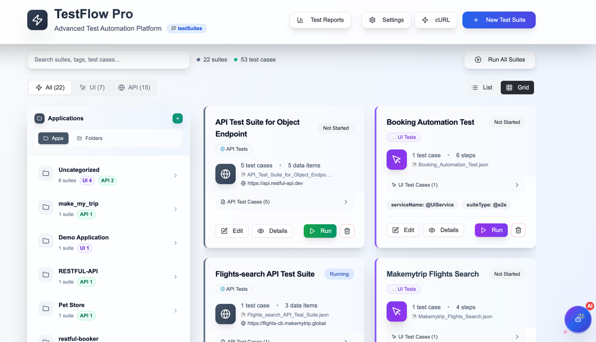
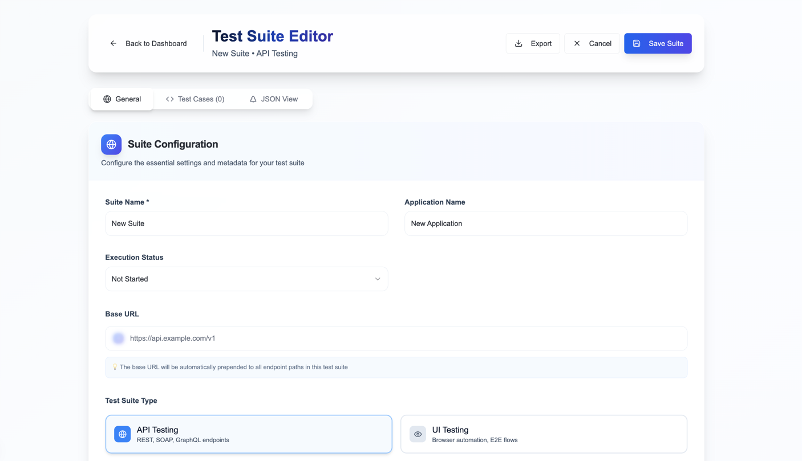
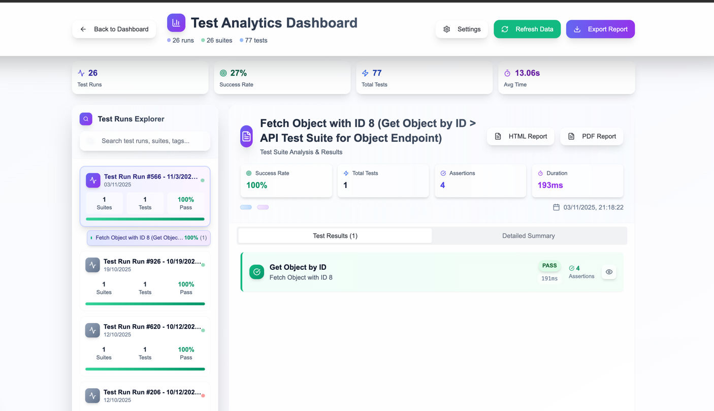

# 📚 TestFlow Pro - Complete Documentation

Welcome to the comprehensive documentation for **TestFlow Pro**, a powerful keyword-driven API and UI automation framework built with TypeScript.

---

## 📖 Table of Contents

### 🚀 Getting Started
- [Installation Guide](./getting-started/installation.md)
- [Quick Start Guide](./getting-started/quick-start.md)
- [Project Structure](./getting-started/project-structure.md)

### 🏗️ Architecture
- [Architecture Overview](./architecture/overview.md)
- [Core Components](./architecture/components.md)
- [Execution Flow](./architecture/execution-flow.md)

### ✨ Features
- [Test Suite Structure](./features/test-suite-structure.md)
- [Variable Store & Injection](./features/variable-store.md)
- [PreProcess Functions](./features/preprocess-functions.md)
- [Assertions](./features/assertions.md)
- [Tags & Filtering](./features/tags-filtering.md)
- [Data-Driven Testing](./features/data-driven-testing.md)
- [Test Dependencies](./features/test-dependencies.md)
- [Schema Validation](./features/schema-validation.md)
- [Database Integration](./features/database-integration.md)

### 🎨 UI Guide
- [Dashboard Overview](./ui-guide/dashboard.md)
- [AI Chat Assistant](./ui-guide/ai-chat-assistant.md)
- [Test Suite Editor](./ui-guide/test-suite-editor.md)
- [Import Options](./ui-guide/import-options.md)
- [Environment Manager](./ui-guide/environment-manager.md)
- [Test Execution](./ui-guide/test-execution.md)
- [Test Results](./ui-guide/test-results.md)

### 💻 CLI Execution
- [Command Line Usage](./cli-execution/command-line.md)
- [Filtering Options](./cli-execution/filtering.md)
- [Granular Execution](./cli-execution/granular-execution.md)
- [Reports Generation](./cli-execution/reports.md)

### 🔄 CI/CD Integration
- [GitHub Actions](./ci-cd/github-actions.md)
- [Azure DevOps](./ci-cd/azure-devops.md)
- [Environment Configuration](./ci-cd/environment-config.md)

### 📝 Examples
- [API Testing Examples](./examples/api-testing.md)
- [UI Testing Examples](./examples/ui-testing.md)
- [SOAP Testing Examples](./examples/soap-testing.md)
- [Advanced Scenarios](./examples/advanced-scenarios.md)

---

## 🎯 Quick Links

| Topic | Description |
|-------|-------------|
| [Installation](./getting-started/installation.md) | Set up TestFlow Pro in minutes |
| [API Testing](./examples/api-testing.md) | Learn REST API testing with examples |
| [UI Testing](./examples/ui-testing.md) | Automate web UI with Playwright |
| [CLI Usage](./cli-execution/command-line.md) | Run tests from command line |
| [GitHub Actions](./ci-cd/github-actions.md) | Integrate with CI/CD pipelines |

---

## 🌟 Key Features at a Glance

### Testing Capabilities
- ✅ **REST API Testing** - Full HTTP method support with assertions
- ✅ **SOAP API Testing** - XML-based web services testing
- ✅ **UI Testing** - Playwright-powered browser automation
- ✅ **Database Testing** - MySQL, ODBC, DB2 integration
- ✅ **Data-Driven** - CSV, JSON, inline data sources
- ✅ **Parallel Execution** - Run multiple suites concurrently

### Authoring & Management
- ✅ **JSON-Based** - No-code test case authoring
- ✅ **Modern UI** - Visual test designer with React
- ✅ **Import Tools** - cURL, Swagger, Postman, Bruno
- ✅ **Variable Store** - Global and local variable management
- ✅ **PreProcess Hooks** - Faker, encryption, DB queries, custom logic

### Reporting & Integration
- ✅ **HTML Reports** - Beautiful, shareable test reports
- ✅ **JSON Reports** - Detailed execution data
- ✅ **CI/CD Ready** - GitHub Actions, Azure DevOps workflows
- ✅ **Tag-Based Filtering** - Run specific test subsets

---

## 📸 Screenshots

### Dashboard

### Test Suite Editor

### Test Results

---

## 🆘 Support & Contribution

For issues, questions, or contributions, please refer to the main [README.md](../README.md) in the project root.

---

## 📄 License

This project is licensed under the ISC License.

---

**Happy Testing! 🚀**
