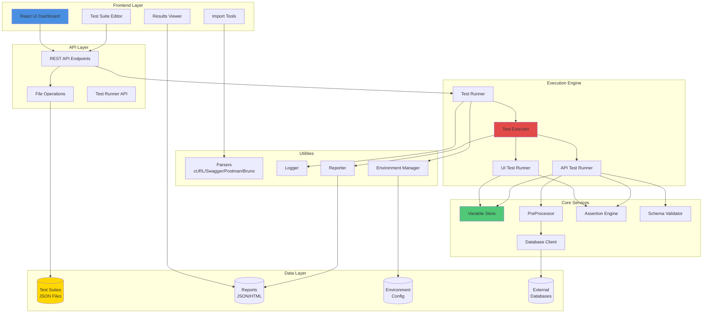
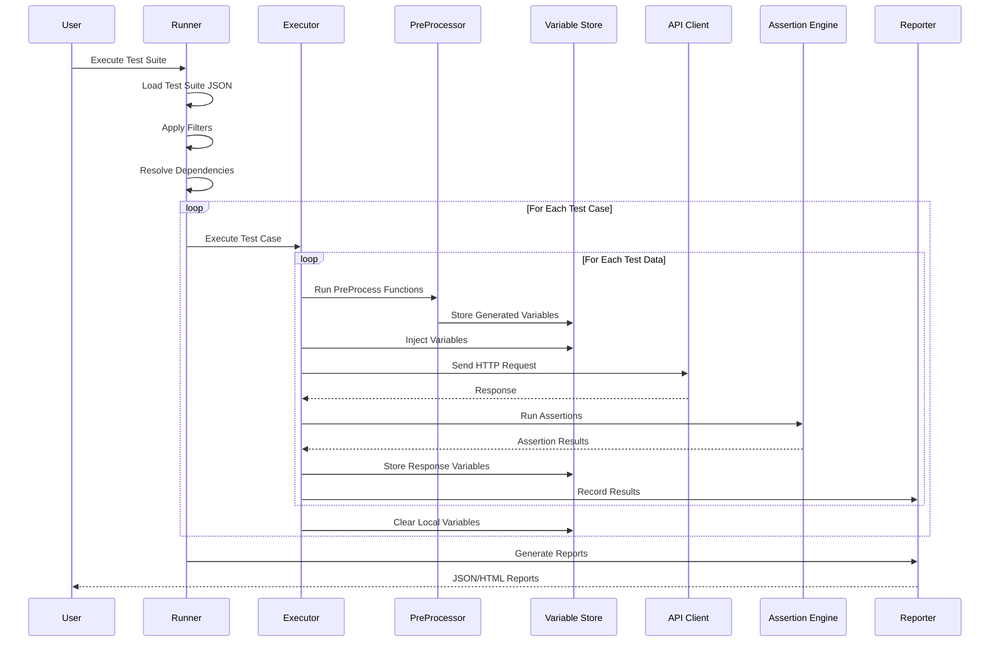

# 🏗️ Architecture Overview

TestFlow Pro is built with a modular, scalable architecture that separates concerns between test authoring, execution, and reporting.

---

## 📐 High-Level Architecture



---

## 🎯 Architecture Layers

### 1. **Frontend Layer** (React + Next.js)

The user interface layer provides visual tools for test management:

- **Dashboard**: Browse and manage test suites
- **Test Suite Editor**: Create and edit test cases visually
- **Import Tools**: Convert external formats to TestFlow format
- **Results Viewer**: Analyze test execution results

**Technology Stack:**
- React 18
- Next.js 14
- TypeScript
- Tailwind CSS
- shadcn/ui components

---

### 2. **API Layer** (Node.js + Express)

RESTful API endpoints for frontend-backend communication:

```typescript
// Key API Endpoints
POST   /api/suites          // Create test suite
GET    /api/suites          // List all suites
GET    /api/suites/:id      // Get specific suite
PUT    /api/suites/:id      // Update suite
DELETE /api/suites/:id      // Delete suite
POST   /api/run             // Execute tests
GET    /api/results         // Get test results
POST   /api/import/curl     // Import from cURL
POST   /api/import/swagger  // Import from Swagger
```

---

### 3. **Execution Engine** (TypeScript)

Core test execution components:

#### **Test Runner** (`src/runner/TestRunner.ts`)
- Orchestrates test execution
- Manages parallel execution
- Handles test filtering
- Controls execution flow

#### **Test Executor** (`src/executor.ts`)
- Executes individual test cases
- Manages test data iterations
- Handles API/UI test routing
- Processes assertions

#### **UI Test Runner** (`src/ui-test.ts`)
- Playwright integration
- Browser automation
- UI element interactions
- Screenshot capture

#### **API Test Runner** (within `executor.ts`)
- HTTP request execution
- SOAP request handling
- Response validation
- Schema validation

---

### 4. **Core Services**

#### **Variable Store** (`src/utils/variableStore.ts`)
```typescript
// Global variables (persist across test cases)
setVariable(key, value)
getVariable(key)

// Local variables (cleared after each test case)
setLocalVariable(key, value)
getLocalVariable(key)

// Variable injection
injectVariables("{{variableName}}")
```

#### **PreProcessor** (`src/preProcessor.ts`)
Executes functions before test execution:
- Faker data generation
- Encryption/decryption
- Database queries
- Custom functions
- Date/time utilities

#### **Assertion Engine** (`src/utils/assertUtils.ts`)
Validates test results:
- JSON path assertions
- XPath assertions (SOAP)
- Status code validation
- Schema validation
- Custom assertions

#### **Schema Validator**
JSON Schema validation using AJV:
- Request schema validation
- Response schema validation
- Inline or file-based schemas

#### **Database Client** (`src/db/dbClient.ts`)
Multi-database support:
- MySQL
- ODBC
- DB2
- Connection pooling
- Query execution

---

### 5. **Utilities**

#### **Parsers**
Convert external formats to TestFlow format:
- **cURL Parser**: HTTP requests from cURL commands
- **Swagger Parser**: OpenAPI/Swagger specifications
- **Postman Parser**: Postman collections (v2.1)
- **Bruno Parser**: Bruno collection files

#### **Logger** (`src/utils/Logger.ts`)
Structured logging with colors:
```typescript
Logger.info("Information message")
Logger.success("Success message")
Logger.warning("Warning message")
Logger.error("Error message")
Logger.section("Section Title")
Logger.box("Title", "Content")
```

#### **Reporter** (`src/reporter.ts`)
Test result collection and reporting:
- JSON reports
- HTML reports
- Execution summaries
- Failure details

#### **Environment Manager** (`src/utils/envManager.ts`)
Environment configuration:
- Load `.env` files
- Environment-specific overrides
- Variable interpolation

---

## 🔄 Execution Flow



---

## 🧩 Component Interactions

### Test Suite Execution Flow

1. **Load Test Suite**
   - Read JSON file from `testSuites/` directory
   - Parse and validate structure
   - Load environment configuration

2. **Apply Filters**
   - Filter by tags (serviceName, suiteType)
   - Filter by application name
   - Filter by test type (API/UI)

3. **Resolve Dependencies**
   - Sort test cases by priority
   - Resolve `dependsOn` relationships
   - Detect circular dependencies

4. **Execute Test Cases**
   - Run in dependency order
   - Skip disabled test cases
   - Handle test failures

5. **Process Test Data**
   - Load parameter data (CSV/JSON/inline)
   - Inject parameters into test data
   - Execute for each parameter set

6. **Run PreProcessors**
   - Generate faker data
   - Execute database queries
   - Run custom functions
   - Store variables

7. **Execute Request**
   - Inject variables into URL/headers/body
   - Send HTTP/SOAP request
   - Capture response

8. **Validate Response**
   - Run assertions
   - Validate schema
   - Store response variables

9. **Generate Reports**
   - Collect execution results
   - Generate JSON reports
   - Generate HTML reports

---

## 🔐 Security Considerations

### Variable Storage
- Variables stored in memory only
- Cleared after test execution
- No persistent storage of sensitive data

### Database Credentials
- Stored in `.env` files
- Not committed to version control
- Environment-specific configuration

### API Authentication
- Support for Bearer tokens
- Cookie-based authentication
- Custom header authentication

---

## 📊 Scalability Features

### Parallel Execution
```typescript
// Configure parallel threads
PARALLEL_THREADS=4
```

### Test Isolation
- Each test case runs independently
- Local variables cleared after execution
- No shared state between tests

### Resource Management
- Browser instances managed by Playwright
- Database connection pooling
- HTTP connection reuse

---

## 🔌 Extension Points

### Custom PreProcess Functions
```typescript
// src/preProcessor.ts
case 'customFunction':
    value = await myCustomFunction(args);
    break;
```

### Custom Test Steps (UI)
```typescript
// src/custom-steps/custom-step-handler.ts
export async function executeCustomStep(page, step) {
    // Custom logic
}
```

### Custom Assertions
```typescript
// src/utils/assertUtils.ts
case 'customAssertion':
    // Custom validation logic
    break;
```

### Custom Parsers
```typescript
// src/utils/customParser.ts
export function parseCustomFormat(input) {
    // Parse and convert to TestFlow format
}
```

---

## 📈 Performance Optimization

### Caching
- Environment variables cached
- Test suite files cached in memory
- Database connections pooled

### Lazy Loading
- Test suites loaded on demand
- Browser instances created when needed
- Database connections established on first use

### Resource Cleanup
- Browser instances closed after tests
- Database connections released
- Temporary files cleaned up

---

## 🔍 Monitoring & Debugging

### Logging Levels
```typescript
Logger.setLevel('debug')  // Verbose logging
Logger.setLevel('info')   // Standard logging
Logger.setLevel('error')  // Errors only
```

### Execution Traces
- Request/response logging
- Assertion details
- Variable state tracking
- Timing information

### Error Handling
- Graceful error recovery
- Detailed error messages
- Stack trace capture
- Failure screenshots (UI tests)

---

## 🚀 Next Steps

- [Core Components](./components.md) - Detailed component documentation
- [Execution Flow](./execution-flow.md) - Deep dive into execution process
- [CLI Usage](../cli-execution/command-line.md) - Command line execution

---

**Understanding the architecture helps you extend and customize TestFlow Pro! 🏗️**
