```mermaid
graph LR
    A[Test Suite Start] --> B[Global Variables Empty]
    B --> C[Test Case 1]
    C --> D[Store Global Variables]
    D --> E[Store Local Variables]
    E --> F[Test Case 1 End]
    F --> G[Clear Local Variables]
    G --> H[Test Case 2]
    H --> I[Global Variables Available]
    I --> J[Store New Local Variables]
    J --> K[Test Case 2 End]
    K --> L[Clear Local Variables]
    L --> M[Test Suite End]
    M --> N[Clear All Variables]
    
    style D fill:#50C878
    style E fill:#FFD700
    style G fill:#E24A4A
    style L fill:#E24A4A
```

# 💾 Variable Store & Injection

The Variable Store is a powerful feature that allows you to store values from API responses or UI elements and reuse them across test cases.

---

## 🎯 Overview

TestFlow Pro provides two types of variable storage:

1. **Global Variables** - Persist across all test cases in a suite
2. **Local Variables** - Scoped to a single test case, cleared after execution

---

## 📦 Variable Types

### Global Variables

Global variables are stored using the `store` property and persist throughout the entire test suite execution.

**Use Cases:**
- Authentication tokens
- User IDs created in setup
- Configuration values
- Data shared between test cases

**Example:**
```json
{
  "name": "Create User",
  "method": "POST",
  "endpoint": "/users",
  "body": {
    "name": "John Doe",
    "email": "john@example.com"
  },
  "store": {
    "userId": "$.id",
    "authToken": "$.token"
  }
}
```

### Local Variables

Local variables are stored using the `localStore` property and are automatically cleared after the test case completes.

**Use Cases:**
- Temporary data within a test case
- Intermediate values
- Test-specific data that shouldn't leak

**Example:**
```json
{
  "name": "Get User Details",
  "method": "GET",
  "endpoint": "/users/123",
  "localStore": {
    "userName": "$.name",
    "userEmail": "$.email"
  }
}
```

---

## 🔍 Storing Variables from API Responses

### Using JSONPath

Store values from JSON responses using JSONPath expressions:

```json
{
  "store": {
    "userId": "$.id",
    "userName": "$.name",
    "userEmail": "$.email",
    "firstAddress": "$.addresses[0].street",
    "allAddresses": "$.addresses"
  }
}
```

**Response Example:**
```json
{
  "id": "12345",
  "name": "John Doe",
  "email": "john@example.com",
  "addresses": [
    { "street": "123 Main St", "city": "New York" },
    { "street": "456 Oak Ave", "city": "Boston" }
  ]
}
```

**Stored Variables:**
- `userId` = "12345"
- `userName` = "John Doe"
- `userEmail` = "john@example.com"
- `firstAddress` = "123 Main St"
- `allAddresses` = [array of addresses]

### Storing from Response Headers

Store values from response headers, including cookies:

```json
{
  "store": {
    "sessionId": "$cookies.JSESSIONID",
    "csrfToken": "$cookies.XSRF-TOKEN",
    "allCookies": "$cookies"
  }
}
```

### Array Object Match

Store values from arrays by matching specific criteria:

```json
{
  "store": [
    {
      "type": "arrayObjectMatch",
      "jsonPath": "$.users",
      "matchField": "role",
      "matchValue": "admin",
      "extractField": "id",
      "variableName": "adminUserId"
    }
  ]
}
```

**Response Example:**
```json
{
  "users": [
    { "id": "1", "name": "John", "role": "user" },
    { "id": "2", "name": "Jane", "role": "admin" },
    { "id": "3", "name": "Bob", "role": "user" }
  ]
}
```

**Result:** `adminUserId` = "2"

---

## 🔄 Variable Injection

### Syntax

Use double curly braces to inject variables:

```
{{variableName}}
```

### Injection Locations

Variables can be injected in:
- URLs/Endpoints
- Headers
- Cookies
- Request Body
- Assertions
- PreProcess arguments

### Examples

#### 1. URL Injection
```json
{
  "method": "GET",
  "endpoint": "/users/{{userId}}/profile"
}
```

#### 2. Header Injection
```json
{
  "headers": {
    "Authorization": "Bearer {{authToken}}",
    "X-User-ID": "{{userId}}"
  }
}
```

#### 3. Body Injection
```json
{
  "body": {
    "userId": "{{userId}}",
    "name": "{{userName}}",
    "email": "{{userEmail}}"
  }
}
```

#### 4. Cookie Injection
```json
{
  "cookies": {
    "sessionId": "{{sessionId}}",
    "token": "{{authToken}}"
  }
}
```

#### 5. Assertion Injection
```json
{
  "assertions": [
    {
      "type": "equals",
      "jsonPath": "$.userId",
      "expected": "{{userId}}"
    }
  ]
}
```

---

## 🎨 UI Testing Variable Store

### Storing from UI Elements

Store text, attributes, or values from UI elements:

```json
{
  "keyword": "getText",
  "locator": {
    "strategy": "css",
    "value": "#username"
  },
  "store": {
    "displayName": "$text"
  }
}
```

### Special UI Variables

- `$text` - Element text content
- `$value` - Input field value
- `$attribute.name` - Specific attribute value

**Example:**
```json
{
  "keyword": "getAttribute",
  "locator": {
    "strategy": "css",
    "value": "#user-id"
  },
  "value": "data-id",
  "store": {
    "userId": "$attribute.data-id"
  }
}
```

---

## 🔗 Variable Chaining

Chain multiple API calls using stored variables:

### Example: Complete User Workflow

```json
{
  "testCases": [
    {
      "name": "User Workflow",
      "testData": [
        {
          "name": "1. Create User",
          "method": "POST",
          "endpoint": "/users",
          "body": {
            "name": "John Doe",
            "email": "john@example.com"
          },
          "store": {
            "userId": "$.id"
          }
        },
        {
          "name": "2. Get User Details",
          "method": "GET",
          "endpoint": "/users/{{userId}}",
          "store": {
            "userName": "$.name"
          }
        },
        {
          "name": "3. Update User",
          "method": "PUT",
          "endpoint": "/users/{{userId}}",
          "body": {
            "name": "{{userName}} Updated"
          }
        },
        {
          "name": "4. Delete User",
          "method": "DELETE",
          "endpoint": "/users/{{userId}}"
        }
      ]
    }
  ]
}
```

---

## 🔐 Authentication Patterns

### Bearer Token Authentication

```json
{
  "testData": [
    {
      "name": "Login",
      "method": "POST",
      "endpoint": "/auth/login",
      "body": {
        "username": "admin",
        "password": "secret"
      },
      "store": {
        "authToken": "$.token"
      }
    },
    {
      "name": "Protected Resource",
      "method": "GET",
      "endpoint": "/api/protected",
      "headers": {
        "Authorization": "Bearer {{authToken}}"
      }
    }
  ]
}
```

### Cookie-Based Authentication

```json
{
  "testData": [
    {
      "name": "Login",
      "method": "POST",
      "endpoint": "/login",
      "body": {
        "username": "admin",
        "password": "secret"
      },
      "store": {
        "sessionId": "$cookies.JSESSIONID"
      }
    },
    {
      "name": "Protected Resource",
      "method": "GET",
      "endpoint": "/api/protected",
      "cookies": {
        "JSESSIONID": "{{sessionId}}"
      }
    }
  ]
}
```

---

## 🧪 Advanced Patterns

### Conditional Variable Storage

Store variables only when certain conditions are met:

```json
{
  "name": "Create User",
  "method": "POST",
  "endpoint": "/users",
  "body": {
    "name": "John Doe"
  },
  "assertions": [
    {
      "type": "statusCode",
      "expected": 201
    }
  ],
  "store": {
    "userId": "$.id"
  }
}
```

**Note:** Variables are stored even if assertions fail, allowing you to capture error details.

### Multiple Variable Sources

Combine variables from different sources:

```json
{
  "preProcess": [
    {
      "var": "randomEmail",
      "function": "faker.email"
    }
  ],
  "body": {
    "email": "{{randomEmail}}",
    "referralCode": "{{existingUserCode}}"
  }
}
```

### Nested Variable Injection

Variables can reference other variables:

```json
{
  "preProcess": [
    {
      "var": "baseUrl",
      "function": "custom.getBaseUrl"
    },
    {
      "var": "fullUrl",
      "function": "custom.buildUrl",
      "args": ["{{baseUrl}}", "/api/users"]
    }
  ]
}
```

---

## 📊 Variable Lifecycle



---

## 🛠️ API Reference

### JavaScript/TypeScript API

```typescript
// Global Variables
setVariable(key: string, value: any): void
getVariable(key: string): any
clearVariables(): void

// Local Variables
setLocalVariable(key: string, value: any): void
getLocalVariable(key: string): any
clearLocalVariables(): void

// Variable Injection
injectVariables(input: string): string

// Response Variable Storage
storeResponseVariables(
  response: any,
  storeConfig: StoreEntry,
  useLocal: boolean = false,
  responseHeaders?: any
): void
```

---

## 💡 Best Practices

### 1. Use Descriptive Variable Names
```json
// ❌ Bad
"store": {
  "id": "$.id",
  "val": "$.value"
}

// ✅ Good
"store": {
  "userId": "$.id",
  "accountBalance": "$.value"
}
```

### 2. Use Local Variables for Temporary Data
```json
// ✅ Good - Won't pollute global scope
"localStore": {
  "tempValue": "$.intermediate.value"
}
```

### 3. Clear Naming Conventions
```json
"store": {
  "user_id": "$.id",           // Snake case
  "user_name": "$.name",
  "user_email": "$.email"
}
```

### 4. Document Variable Dependencies
```json
{
  "name": "Update User Profile",
  "description": "Requires: userId, authToken",
  "method": "PUT",
  "endpoint": "/users/{{userId}}",
  "headers": {
    "Authorization": "Bearer {{authToken}}"
  }
}
```

### 5. Handle Missing Variables Gracefully
```json
{
  "assertions": [
    {
      "type": "exists",
      "jsonPath": "$.id",
      "description": "Ensure ID exists before storing"
    }
  ],
  "store": {
    "userId": "$.id"
  }
}
```

---

## 🐛 Troubleshooting

### Variable Not Found

**Problem:** Variable injection returns empty string

**Solutions:**
1. Check variable name spelling
2. Verify variable was stored in previous test
3. Check if using local variable after test case ended
4. Verify JSONPath expression is correct

### Variable Not Storing

**Problem:** Variable not available in subsequent tests

**Solutions:**
1. Check JSONPath expression matches response structure
2. Verify response contains expected data
3. Check for typos in variable name
4. Ensure using `store` not `localStore` for cross-test variables

### Variable Overwriting

**Problem:** Variable value changes unexpectedly

**Solutions:**
1. Use unique variable names
2. Use local variables when appropriate
3. Check for multiple stores with same variable name

---

## 📚 Related Documentation

- [PreProcess Functions](./preprocess-functions.md) - Generate dynamic data
- [Assertions](./assertions.md) - Validate stored values
- [API Testing Examples](../examples/api-testing.md) - Real-world examples
- [Test Dependencies](./test-dependencies.md) - Chain test cases

---

**Master variable management for powerful test automation! 💪**
