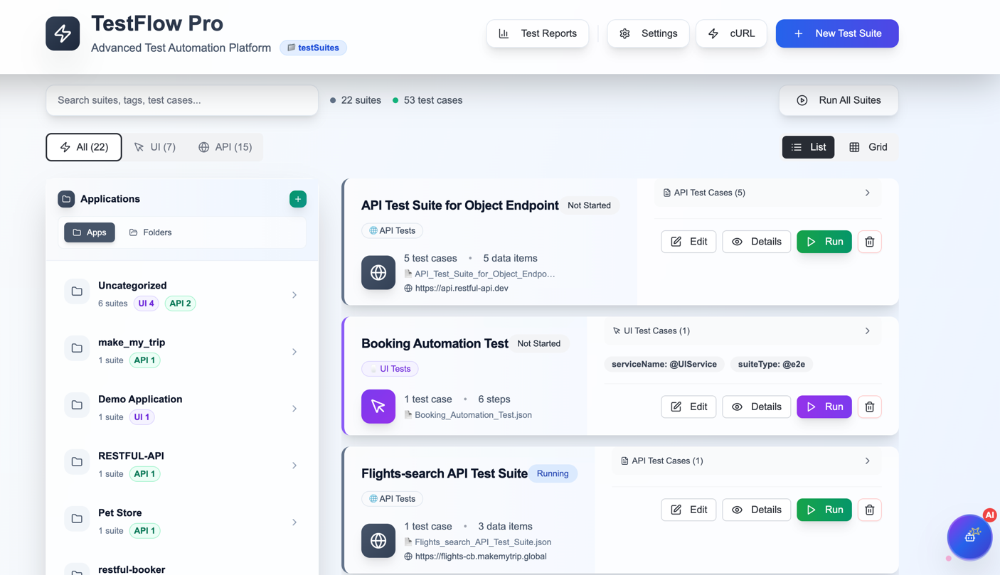
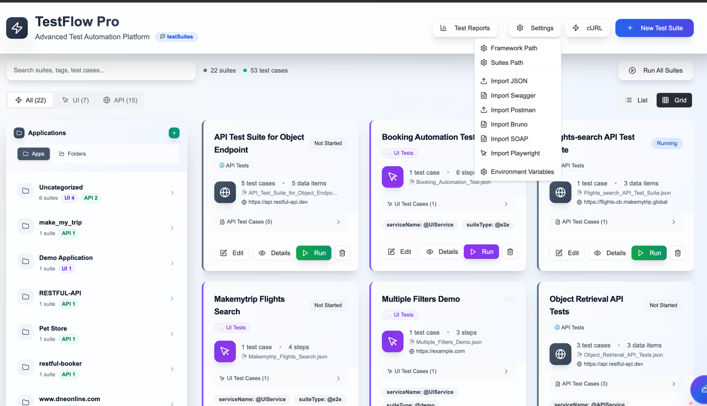

# 🎨 Dashboard Overview

Complete guide to the TestFlow Pro UI Dashboard - your central hub for test management.

---

## 🚀 Getting Started

### Launching the Dashboard

```bash
cd frontend/TestEditor
npm run dev
```

Access at: **http://localhost:3000**

---

## 📸 Dashboard Views

### Grid View


The grid view displays test suites as cards with:
- Suite name and application
- Test type badge (API/UI)
- Tag indicators
- Quick action buttons
- Test case count

### List View



The list view shows test suites in a table format with:
- Sortable columns
- Compact information display
- Bulk selection options
- Quick filters

---

## 🎯 Key Features

### 1. **Fixed Header Navigation**

The header remains visible while scrolling and includes:

- **TestFlow Pro Logo** - Click to return to dashboard
- **Search Bar** - Real-time test suite filtering
- **View Toggle** - Switch between Grid and List views
- **Settings Menu** - Access configuration options
- **Import Button** - Quick access to import tools

### 2. **Application Sidebar**

**Width:** 320px (fixed)

Organizes test suites by application:
- Hierarchical folder structure
- Visual tree connections
- Application grouping
- Suite count badges
- Expand/collapse folders

**Features:**
- Click application to filter suites
- Expand folders to see nested suites
- Color-coded icons:
  - 🔵 Blue folders
  - 💜 Purple UI tests
  - 💚 Emerald API tests

### 3. **Search & Filtering**

**Real-time search across:**
- Suite names
- Application names
- Tags
- Test case names
- Keywords

**Filter Options:**
- By application
- By test type (API/UI)
- By tags
- By status

### 4. **Test Suite Cards**

Each card displays:

**Header:**
- Suite name
- Application name
- Type badge (API/UI)

**Body:**
- Base URL
- Tags (serviceName, suiteType)
- Test case count
- Last run status

**Actions:**
- ▶️ Run - Execute test suite
- ✏️ Edit - Open in editor
- 📋 Clone - Duplicate suite
- 🗑️ Delete - Remove suite

---

## 🎨 Visual Design

### Color Scheme

**Professional Slate Theme:**
- Background: `#0f172a` (slate-900)
- Cards: `#1e293b` (slate-800)
- Borders: `#334155` (slate-700)
- Text: `#f1f5f9` (slate-100)
- Accents: Blue, Purple, Emerald

### Typography

- **Headers:** Bold, 24px
- **Suite Names:** Semibold, 18px
- **Body Text:** Regular, 14px
- **Labels:** Medium, 12px

### Animations

- Smooth hover effects (200ms)
- Card elevation on hover
- Button transitions
- Fade-in effects

---

## 🔧 Settings Menu



Access via gear icon in header:

### Options

1. **Environment Variables**
   - Edit .env files
   - Manage configurations
   - Add/remove variables

2. **Framework Configuration**
   - Set parallel threads
   - Configure timeouts
   - Browser settings

3. **Path Configuration**
   - Test suites directory
   - Reports directory
   - Schemas directory

4. **Import Settings**
   - Default import options
   - Parser configurations

---

## 📊 Test Suite Actions

### Running Tests

**Single Suite:**
1. Click ▶️ Run button on suite card
2. Select execution options
3. Monitor progress in modal
4. View results when complete

**Multiple Suites:**
1. Use "Run All" button in header
2. Select suites to run
3. Configure parallel execution
4. Monitor batch progress

### Editing Suites

1. Click ✏️ Edit button
2. Opens Test Suite Editor
3. Modify suite details
4. Save changes

### Cloning Suites

1. Click 📋 Clone button
2. Enter new suite name
3. Optionally modify details
4. Save cloned suite

### Deleting Suites

1. Click 🗑️ Delete button
2. Confirm deletion
3. Suite removed from filesystem

---

## 🔍 Search Functionality

### Search Bar Features

**Location:** Top center of header

**Capabilities:**
- Real-time filtering
- Case-insensitive search
- Multi-field search
- Instant results

**Search Fields:**
- Suite name
- Application name
- Tags (serviceName, suiteType)
- Test case names
- Endpoints
- Keywords

### Search Examples

```
Search: "user"
Results: All suites containing "user" in any field

Search: "@smoke"
Results: All suites tagged with @smoke

Search: "API"
Results: All API test suites

Search: "Bookstore"
Results: All suites for Bookstore application
```

---

## 📁 Folder Tree Structure

### Hierarchy

```
📁 Applications
  📁 Bookstore Application
    📄 User Management Suite (API)
    📄 Order Processing Suite (API)
    📄 UI Checkout Flow (UI)
  📁 E-commerce Platform
    📄 Product Catalog Suite (API)
    📄 Shopping Cart Suite (UI)
  📁 Admin Portal
    📄 User Admin Suite (UI)
```

### Visual Elements

- **Folders:** Blue folder icons
- **API Suites:** Emerald document icons
- **UI Suites:** Purple document icons
- **Badges:** Test count, type indicators
- **Connections:** Tree lines showing hierarchy

---

## 🎯 Quick Actions

### Header Actions

**Create New Suite:**
1. Click "+ New Suite" button
2. Choose template (API/UI)
3. Fill in details
4. Save

**Import:**
1. Click "Import" button
2. Select import type:
   - cURL
   - Swagger/OpenAPI
   - Postman Collection
   - Bruno Collection
3. Follow import wizard

**Run All:**
1. Click "Run All" button
2. Configure filters
3. Set parallel threads
4. Start execution

### Context Menu

Right-click on suite card for:
- Run
- Edit
- Clone
- Delete
- Export
- View Results

---

## 📊 Status Indicators

### Suite Status

- 🟢 **Passed** - All tests passed
- 🔴 **Failed** - One or more tests failed
- 🟡 **Running** - Currently executing
- ⚪ **Not Started** - Never executed
- 🔵 **Partial** - Some tests skipped

### Visual Indicators

- Color-coded badges
- Progress bars (during execution)
- Last run timestamp
- Pass/fail counts

---

## 🎨 Customization

### View Preferences

**Grid View Settings:**
- Card size
- Cards per row
- Sort order

**List View Settings:**
- Column visibility
- Column order
- Row height

### Theme Options

- Dark mode (default)
- Light mode
- Custom accent colors

---

## 🔄 Real-Time Updates

### Auto-Refresh

Dashboard automatically updates when:
- New suite created
- Suite modified
- Test execution completes
- Suite deleted

### Live Execution

During test execution:
- Progress indicators
- Real-time status updates
- Live log streaming
- Completion notifications

---

## 📱 Responsive Design

### Desktop (1920px+)
- Full sidebar (320px)
- Grid view: 3-4 cards per row
- All features visible

### Laptop (1366px)
- Full sidebar
- Grid view: 2-3 cards per row
- Compact header

### Tablet (768px)
- Collapsible sidebar
- Grid view: 1-2 cards per row
- Touch-optimized buttons

### Mobile (< 768px)
- Hidden sidebar (toggle button)
- List view only
- Stacked layout

---

## 💡 Tips & Tricks

### 1. Keyboard Shortcuts

- `Ctrl/Cmd + K` - Focus search
- `Ctrl/Cmd + N` - New suite
- `Ctrl/Cmd + I` - Import
- `Ctrl/Cmd + R` - Refresh
- `Esc` - Clear search

### 2. Bulk Operations

- Select multiple suites with checkboxes
- Run selected suites together
- Delete multiple suites
- Export multiple suites

### 3. Quick Filters

- Click application in sidebar to filter
- Click tag to filter by tag
- Click type badge to filter by type

### 4. Sorting

**Grid View:**
- Drag to reorder
- Sort by name, date, status

**List View:**
- Click column headers to sort
- Multi-column sorting

### 5. Search Tips

- Use quotes for exact match: `"User API"`
- Use @ for tags: `@smoke`
- Combine terms: `API @regression`

---

## 🐛 Troubleshooting

### Dashboard Not Loading

1. Check if backend is running
2. Verify port 3000 is available
3. Clear browser cache
4. Check console for errors

### Suites Not Appearing

1. Verify testSuites directory exists
2. Check file permissions
3. Validate JSON syntax
4. Refresh dashboard

### Search Not Working

1. Clear search input
2. Refresh page
3. Check browser console
4. Verify search index

---

## 🔗 Related Documentation

- [Test Suite Editor](./test-suite-editor.md)
- [Import Options](./import-options.md)
- [Test Execution](./test-execution.md)
- [Test Results](./test-results.md)

---

**Master the dashboard for efficient test management! 🎯**
